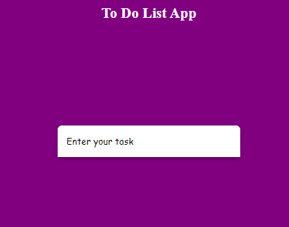
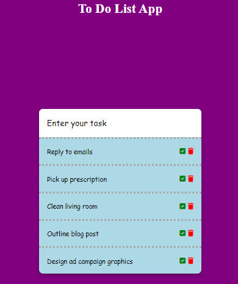
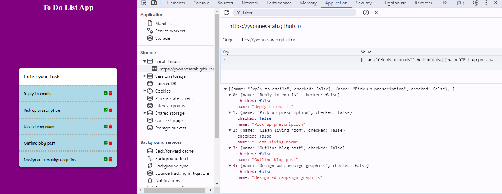

# To-do-list

## Description
The To-Do List Web App is a simple and user-friendly application designed to help users manage their tasks efficiently. Built with HTML, CSS, and JavaScript, can add a new task to the list using the input field. Plus, to-do list is unique in that even after refreshing the page, the tasks remain saved. By utilizing JavaScript, shows you how to set and get items from local storage. With each task, there are two icons: a check mark and a trash bin. The check mark allows you to mark the task as completed, while the trash bin lets you delete the task. Each task will also be saved in the local storage.

## Prerequisites
N/A

## Technologies Used
Built with:
* HTML
* CSS
* JavaScript
* Local Storage

## Installation
N/A

## Usage
N/A

## Project Link
Application can can be viewed here: 
* [Live](https://yvonnesarah.github.io/To-do-list/)

* [Repository](https://github.com/yvonnesarah/To-do-list)

## Screenshot(S)
To do list

To do list Example

To do list Local Storage

## Credit
N/A

## Licence
Please refer to the LICENSE in the repo.